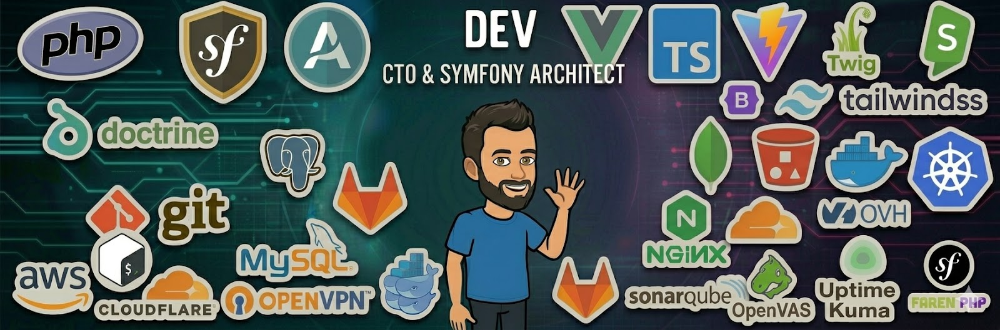

# Héctor Franco 👋

### CTO · Symfony Architect · Product-Minded Engineer 🚀

I build scalable web platforms, reusable Symfony tooling, and automation-driven products.

  
  
  

---

## 🙋 About me

I'm a **hands-on CTO and software engineer** focused on building maintainable digital products with a strong backend foundation.

My work usually sits at the intersection of:

- ⚙️ **Symfony architecture**
- 🧠 **DDD and clean design**
- 🤖 **business automation**
- 🛠️ **internal tooling**
- 👨‍💻 **developer experience**
- 📈 **product execution**

I enjoy turning complex business requirements into systems that are easier to scale, easier to maintain, and easier for teams to evolve.

---

## 🧰 Tech Stack & Tools

### Core & Backend

  
  
  
  
  
  
  

### Frontend & UI

  
  
  
  
  
  
  

### Databases & Storage

  
  
  
  

### DevOps, Cloud & Infra

  
  
  
  
  
  

### Tooling, Quality & Automation

  
  
  
  
  
  
  

---

## 🔭 Current Focus

- Building **reusable Symfony bundles**
- Improving **developer tooling** and code quality workflows
- Designing **automation platforms** and workflow-based systems
- Working on **maintainable architecture** for real-world business applications
- Contributing fixes and modernization efforts to the PHP / Symfony ecosystem

---

## 🏗️ Featured Work

### Symfony Bundles & Tooling 📦

- [**AnonymizeBundle**](https://github.com/nowo-tech/AnonymizeBundle)  
  Anonymize database records using attributes and configurable strategies.

- [**PerformanceBundle**](https://github.com/nowo-tech/PerformanceBundle)  
  Route performance tracking and execution metrics for Symfony applications.

- [**TwigInspectorBundle**](https://github.com/nowo-tech/TwigInspectorBundle)  
  Improve Twig template and block discovery during development.

- [**SepaPaymentBundle**](https://github.com/nowo-tech/SepaPaymentBundle)  
  Tools for SEPA validation, mandates, direct debit, and transfer generation.

- [**DashboardMenuBundle**](https://github.com/nowo-tech/DashboardMenuBundle)  
  Configurable dashboard menus with permissions, tree structure, and Twig rendering.

- [**ControllerKitBundle**](https://github.com/nowo-tech/ControllerKitBundle)  
  Practical controller utilities for Symfony projects.

- [**MigrationsKitBundle**](https://github.com/nowo-tech/MigrationsKitBundle)  
  Helpers for safer and more expressive Doctrine migrations.

- [**PasswordPolicyBundle**](https://github.com/HecFranco/PasswordPolicyBundle)  
  Password history, expiration rules, and policy enforcement for Symfony applications.

- [**FormKitBundle**](https://github.com/nowo-tech/FormKitBundle)  
  Convention-based improvements for Symfony forms.

- [**ComposerUpdateHelper**](https://github.com/nowo-tech/ComposerUpdateHelper)  
  Generate useful composer commands from outdated dependencies.

- [**CodeReviewGuardian**](https://github.com/nowo-tech/CodeReviewGuardian)  
  Provider-agnostic guardrails for code review workflows in PHP projects.

> Most of these projects live in the [**nowo-tech organization**](https://github.com/orgs/nowo-tech/repositories) 🏢

---

## 🌍 Open Source & Ecosystem

I like contributing where architecture, compatibility, and developer experience matter.

Recent public activity includes work and issue reporting around:

- [**LexikTranslationBundle**](https://github.com/lexik/LexikTranslationBundle)
- [**LiipMonitorBundle**](https://github.com/liip/LiipMonitorBundle)
- [**NelmioApiDocBundle**](https://github.com/nelmio/NelmioApiDocBundle)
- Symfony compatibility updates
- modernization efforts around PHP attributes, CI, code quality, and frontend tooling

---

## 💡 Philosophy

I like software that is:

- ✅ maintainable
- 🔎 explicit
- 📈 scalable
- 🏭 useful in production
- 🎯 aligned with business goals

Good software is not just about shipping fast — it's about making future change cheaper.

---

## 📊 GitHub Analytics

---

## 🤝 Let's Connect

- LinkedIn: [hector-franco-aceituno](https://www.linkedin.com/in/hector-franco-aceituno)
- GitHub: [@HecFranco](https://github.com/HecFranco)
- nowo-tech: [organization repositories](https://github.com/orgs/nowo-tech/repositories)

---

  🛠️ Building robust systems, reusable tools, and long-term software.

